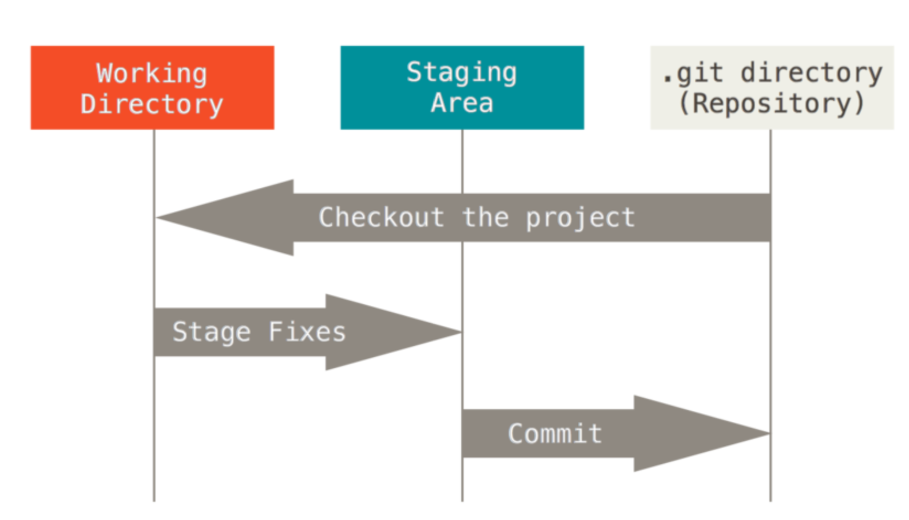
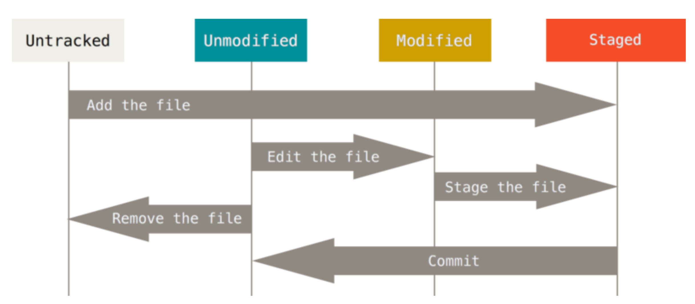

# git基础概念

## git track文件的三种状态

* 已修改（modified）
文件被修改，但未提交到暂存区

* 已暂存（staged）
文件被提交到暂存区，但未保存到git仓库中

* 已提交（committed）
文件已经被保存到git仓库中，并可以根据提交的hash值找回

## git的三个工作区域

* 工作目录
* 暂存区
* git仓库

**除此之外，git还有一个未跟踪的状态，表示文件还没有被git系统跟踪，如果想要让git仓库跟踪某个文件，需要认为的将文件状态改为已跟踪**



## git的工作流程

1. 在工作区域中修改文件
2. 暂存文件，将文件放入快照
3. 提交更新，找到暂存区域的文件，将快照永久性存储到 Git 仓库目录

git中文件状态的变化如下图所示：



# git操作

## 安装、配置git
### 安装
* ubuntu
```bash
$ sudo apt-get install git
```

* Mac
```bash
$ brew install git
```

### 配置
在git运行之前，需要进行一些初始化的配置，这些配置会存储在三个不同的配置文件中。
1. /etc/gitconfig这个文件中存储的是全局的git配置，对所有用户有效。使用git config命令配置的时候需要加上`--system`参数。
2. ~/.gitconfig 或 ~/.config/git/config这个文件中存储的是当前用户的git配置，仅对当前用户有效。使用git config命令配置的时候需要加上`--global`参数。
3. 项目目录下的.git/config，仅对当前项目有效，配置时不需要添加额外的参数。

要配置git可以直接去修改文件，也可以使用git config命令。

* 配置用户信息
```bash
$ git config --global user.name "your name"
$ git config --global user.email "youremail@email.com"
```

* 配置git调用的编辑器
有些版本的git默认的编辑器用的是nano，我们可以把它配置成vim
```bash
$ git config --global core.editor vim
```
> 不要把git默认的编辑器设置成atom、sublime这种图形化编辑器。
> 不要问我为什么。

#### github配置ssh key
这一部分和本地配置没多大关系，github有两种连接方式https和ssh，https每次push都要输入密码，太麻烦了。可以在github上配置一个ssh key，然后clone或者remote add的时候使用git@github.com···的那个连接，最后完成下面的这段配置就不用每次push的时候输入密码了。

ssh连接的时候需要使用到公钥和私钥，一般这些文件存在~/.ssh目录下的，可以用`ls -al ~/.ssh`命令检查一下ssh的key是否存在。

如果不存在，可以使用下面这条命令生成ssh key
```bash
$ ssh-keygen -t rsa -C "your_email@example.com"
```
然后用户目录下就多了一个.ssh文件夹，里面有两个文件id_rsa和id_rsa.pub。
id_rsa里面存储的是你的私钥，id_rsa.pub里面存储的是你的公钥。

接着，登录github网站，点击你的头像，一次选择settings/keys，然后把你的id_rsa.pub里面的内容添加到github的ssh key列表里面去就好了。

以后你再用你本机上的git就不需要每次输入账号密码了。

关于这一点github的文档讲的挺清楚了
[https://help.github.com/en/articles/generating-a-new-ssh-key-and-adding-it-to-the-ssh-agent](https://help.github.com/en/articles/generating-a-new-ssh-key-and-adding-it-to-the-ssh-agent)
[https://help.github.com/en/articles/adding-a-new-ssh-key-to-your-github-account](https://help.github.com/en/articles/adding-a-new-ssh-key-to-your-github-account)

## 初始化git仓库
### 在当前目录中初始化git仓库
* 创建本地仓库
```bash
$ git init
```
这种方法初始化git仓库之后会在当前目录创建一个.git文件夹，这个文件夹保存着git相关的信息。

* 创建远程仓库
在github这种网站上创建远程仓库都是有ui的，可以直接点点点。
* 和远程仓库连接
创建好远程仓库了之后，本地仓库还不知道远程仓库的地址，所以还要进一步配置，让本地git知道可以把本地仓库push到什么地方
```bash
$ git remote add origin git@github.com:mrssss/test.git
```
这个时候git就把远程仓库绑定到了origin这个名字下面，当然你还可以设置其他名字，甚至可以设置其他仓库
```bash
$ git remote add gitlab git@gitlab.com:mrssss/test_gitlab.git
$ cat .git/config
···
[remote "origin"]
	url = git@github.com:mrssss/test.git
	fetch = +refs/heads/*:refs/remotes/origin/*
[remote "gitlab"]
	url = git@gitlab.com:mrssss/test_gitlab.git
	fetch = +refs/heads/*:refs/remotes/gitlab/*
```
这里我设置了第二个remote仓库，可以看到当前项目的config文件中存储了两条remote仓库的信息。如果想push到github仓库可以用`git push origin ···`，想要push到gitlab仓库就可以用`git push gitlab ···`。
你还可以用这个功能把github仓库上的东西pull下来直接push到gitlab仓库中

* 同步本地和远程仓库的branch
在设置好remote仓库之后，本地仓库和远程仓库都有一个master的分支，但是这两个分支的历史不一样，不管你进行git pull操作或进行git push操作都是行不通的。这个时候需要强行的将两个历史不同的分支merge在一起。
```bash
$ git pull origin master --allow-unrelated-histories
```
这时候，两个仓库就可以直接通过pull和push进行同步了。

### 使用git clone直接下载远程仓库
第一种初始化git仓库的方法太麻烦了，一般我们创建git仓库都是直接在网站上点点点，然后在本地执行git clone命令
```bash
$ git clone git@github.com:mrssss/test.git
```
git clone命令会在当前文件夹下新建一个与远程仓库同名的文件夹，下面的git也配置好了，可以直接和远程服务器同步。

## git工作流程对应的最常用的命令

### git add

当你修改了一个文件之后，需要让git去track这个文件并把这个文件保存到暂存去，就需要用到git add命令。
```bash
# 暂存某个文件
$ git add filename

# 暂存某个目录下的所有文件
$ git add dirname

# 暂存所有文件
$ git add --all
```
有时候，我们并不希望一个一个的add文件，又怕`git add --all`把一些敏感的，太大的，没用的文件存下来，这时候就可以用到一个git的功能了gitignore。

git add的时候会忽略掉项目目录下“.gitignore”文件里面列出来的文件，gitignore文件支持linux通配符。
如果又什么文件不想让git track，把它的名字写在。gitignore里面就好了。

### git mv
// TODO

### git rm
//TODO

### git commit

当我们完成了一段时间的工作，觉得没有问题，需要保存在git仓库的时候，可以用这个命令。git commit可以把暂存区中的文件放入git仓库中。

```bash
$ git commit -m "message about this commit"
```

把这次提交放到git仓库中有一个好处，如果你发现哪里有问题可以回退。如果不小心把一些重要的文件删除了，也可以通过以前的commit来找回文件。


### git reset

### git checkout

在多人进行共同开发的时候或者一个人在同时开发不同的特性的时候，可能这个特性的改动会对另外一个特性的造成一定的影响，这时候可以使用多个分支来操作。
* 创建并切换新分支
	```bash
	$ git checkout -b branch_name
	```
* 切换分支已经存在的
	```bash
	$ git checkout branch_name
	```
一般来说，如果共同工作，每个特性都应该创建一个新的分支。不要直接对master或develop分支进行改动，更不应该直接push到master或develop分支。

//TODO: git checkout -- filename

### git branch
//TODO

### git pull
在共同合作的场景下，如果有其他人把代码上传到远程服务器上，你又想在你的分支中使用那段代码的话，可以使用git pull命令。
```bash
$ git pull origin branch_name
```

### git push
git push是git pull的逆操作，在你完成工作后，可以使用这个命令把代码上传带远程服务器上。
```bash
$ git push origin branch_name
```
这里的branch_name需要和当前的分支名称对应，如果不一样，git会报错。

### git status
最常用的git命令，有时候我们需要知道git track的文件状态，可以直接使用git status命令
```bash
$ git status
```
平时我在使用其他git命令的之前，都会先看看git status，以便决定下一步应该进行什么操作。

### git stash
//TODO

### git rebase
//TODO

### git merge
//TODO

### git diff
//TODO

### git fetch
//TODO

### git log
//TODO
