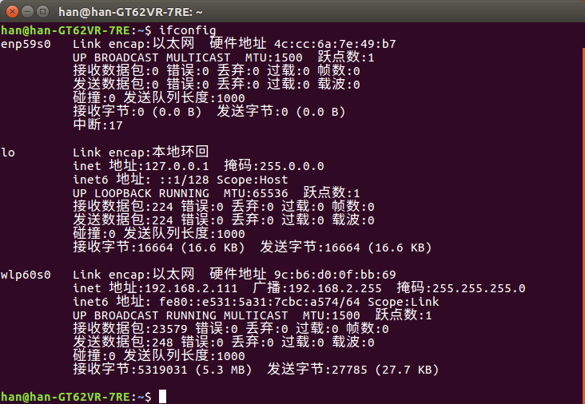
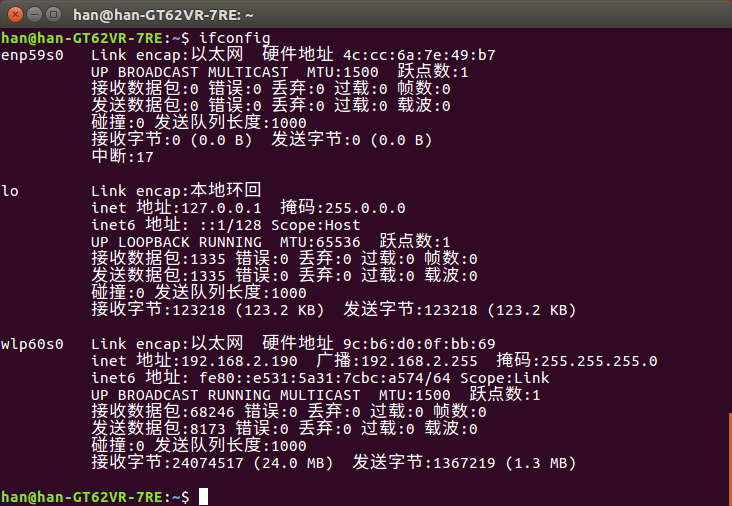

# Ubuntu配置IP

## 查看电脑的网卡信息
```
ifconfig
```

 
可以看出连接的无线网卡为**wlp60s0**

由于默认开启DHCP，因此分配到的IP为**192.168.2.190**

## 配置固定IP
```
ifconfig wlp60s0 address 192.168.2.111
```
设置无线网卡的IP为**192.168.2.111**
查看改变后的网卡状态

## 配置动态IP
动态IP分配是由 ***DHCP*** 实现的
先释放当前租约并停止正在运行的DHCP客户端
````bash
sudo dhclient wlp60s0 -r
````
之后再开启DHCP客户端
```bash
sudo dhclient wlp60s0
```

非常巧的是得到的IP与之前的IP一样为**192.168.2.190**
